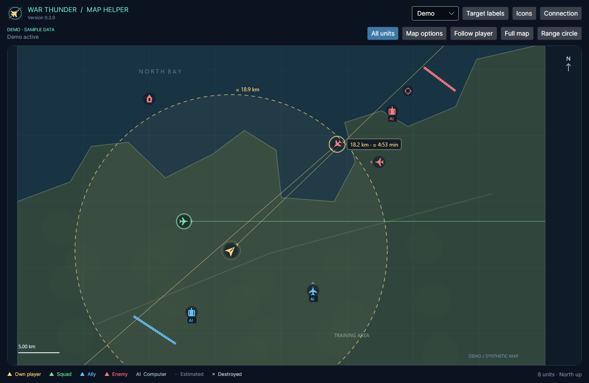

# War Thunder Map Helper

An independent desktop tactical map for War Thunder, focused on air combat.
Built with C#, .NET 10, and Avalonia 12 for Windows and Linux.

The application reads the game's HTTP map interface, normally at
`http://127.0.0.1:8111/`. It shows available contacts, course lines, direct
distances, estimated travel times, and a fuel-based range circle. It starts
without a running game and waits for a connection. An explicitly selected
**Demo** mode provides synthetic data.

The interface, documentation, and application-generated messages are in English.
Names, identifiers, and HUD messages supplied by the game remain unchanged.



## Install and start

Find release assets on the
[GitHub Releases page](https://github.com/VoltKraft/WarThunder_Map_Helper/releases).
Choose the package for your operating system and processor architecture.
Self-contained Windows and Linux archives include the .NET runtime.

- **Windows:** install the MSI, or extract the entire portable ZIP and run
  `WarThunderMapHelper.exe`. The MSI installs for the current user and creates
  Start Menu and desktop shortcuts.
- **Linux:** use the archive or Flatpak instructions in
  [Distribution](docs/DISTRIBUTION.md). WinGet and Flathub availability and
  initial submission requirements are documented there.

Start War Thunder normally and enter a battle or test flight. Use **Connection**
to change the endpoint when the game runs on another machine. Use **Demo** to
explore the application without a game session.

See the [User guide](docs/USAGE.md) for controls, settings, custom icons, data
locations, and troubleshooting.
When upgrading from 0.1.x, review the
[SVG icon compatibility change](docs/USAGE.md#svg-compatibility-in-020).

## Features

- Pan and zoom, follow your aircraft, or automatically frame all visible units.
- Display squad and target course lines, API target markers, and configurable
  distance/time labels.
- Measure map distances with a right-button drag and inspect contacts on hover.
- Estimate fuel endurance and one-way range from observed consumption and speed.
- Import SVG/PNG icons and use original icons exposed by the local game server
  when available.

Only data exposed by the HTTP interface can be displayed. Contact identity,
AI classification, target selection, weapons, and destruction events have
limitations that depend on the game mode and available fields. See
[Data limitations](docs/USAGE.md#data-limitations) and the
[projectile API investigation](docs/PROJECTILE_API.md).

## Development

Install the .NET 10 SDK selected by `global.json`, then run:

```text
dotnet restore WarThunderMapHelper.slnx
dotnet build WarThunderMapHelper.slnx -c Release --no-restore
dotnet test WarThunderMapHelper.slnx -c Release --no-build
dotnet run --project src/MapHelper.Desktop -- --demo
```

The [Development guide](docs/DEVELOPMENT.md) describes platform prerequisites,
formatting, verification, and build commands. The
[architecture overview](docs/ARCHITECTURE.md) explains the core, telemetry, and
desktop boundaries. Release automation and package-manager submissions are
documented in [Distribution](docs/DISTRIBUTION.md).

## Project information

- [Contributing](CONTRIBUTING.md) and [Code of conduct](CODE_OF_CONDUCT.md)
- [Changelog](CHANGELOG.md) and [validation history](docs/VALIDATION.md)
- [Security policy](SECURITY.md) and [third-party notices](THIRD_PARTY_NOTICES.md)
- [Application artwork and reproducible exports](https://github.com/VoltKraft/WarThunder_Map_Helper/blob/v0.2.0/src/MapHelper.Desktop/Assets/branding/README.md)

Licensed under the [GNU Affero General Public License v3](LICENSE).

War Thunder Map Helper is an independent community project and is not
affiliated with or endorsed by Gaijin Entertainment. Original game graphics
are not bundled with the application.
