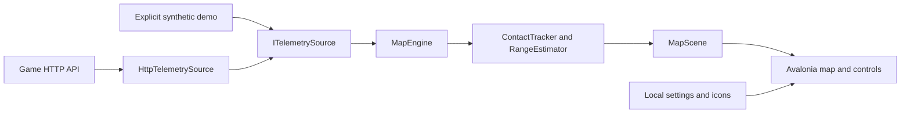

# Architecture

War Thunder Map Helper is a standalone Avalonia desktop application. It reads
the game's optional HTTP telemetry, converts it to a platform-independent
scene, and renders that scene. It has no server, accounts, database, or hosted
service.

## Boundaries

| Module | Responsibility | Must not depend on |
| --- | --- | --- |
| `MapHelper.Core` | Geometry, tracking, target navigation, display decisions, range estimation, immutable scene models | Avalonia, native graphics, HTTP clients, packaging |
| `MapHelper.Telemetry` | Independent bounded endpoint polling, parsing, explicit demo stream | Desktop controls or installer behavior |
| `MapHelper.Desktop` | UI dispatch, rendering, icon loading, settings, process lifecycle | Hidden game state or elevated privileges |
| `packaging` | Self-contained publish, MSI, archives, Flatpak, store metadata | Changes to core behavior for a particular installer |

`Program.Main` selects the English culture and builds Avalonia. `MainWindow`
owns the active source and map engine. `ITelemetrySource.ReadAsync` produces
packets asynchronously and must honor cancellation; disposal releases network
resources. `MapEngine` consumes ordered updates and exposes scenes. Its mutable
state is owned by the application update path, not shared freely across
threads. Rendering and control changes belong on the Avalonia UI thread.

## Telemetry contracts

Positions in API map objects are normalized map coordinates; `MapInfo`
converts them to world meters using the supplied bounds. Invalid or missing
bounds cannot establish a physical distance. Direction, velocity, and time
estimates are valid only when their required measurements are available.
Packet time is monotonic seconds, not wall-clock time. A map epoch/session ID
prevents late responses from an earlier mission contaminating a new scene.

The source polls map information, map objects/image, player state, indicators,
mission state, and HUD events independently. Slow or failed optional endpoints
must not freeze the map. The application starts and remains usable when the
game is closed; it never silently substitutes demo data for failed live data.

Objects may lack stable IDs. Contact association is therefore an estimate,
and ambiguous matches must not produce false speed or identity claims.
Short extrapolation, stale contacts, confirmed destruction, and current data
are separate states. Unknown API fields are retained as raw values.

An API target background is a map marker, not proof of radar lock. HUD text
alone cannot establish a destruction location. Unit identity and weapon data
must not be inferred from undocumented numeric values. The detailed user
contract and endpoint limitations live in [Usage](USAGE.md) and
[Projectile API observations](PROJECTILE_API.md).

## Persistence and trust

`AppSettings` stores JSON preferences and icon mappings in the user profile.
Version 0.2.0 changes presentation language without renaming saved fields.
Legacy options receive documented defaults and explicit saved choices remain
intact. Windows installers preserve user data on uninstall.

Network data and imported SVG/PNG files are untrusted inputs. Enforce limits
before parsing, disallow active/external SVG content, and do not traverse out
of the configured icon directory. No game icons fetched at runtime are
redistributed as project assets. See [Security](../SECURITY.md) for reporting
and operational boundaries.

## Release contract

Application version, assembly identity, MSI version, AppStream metadata, and
changelog entries must agree. A release is built from one tested commit,
contains architecture-specific artifacts and hashes, and becomes immutable
when published. Detailed workflow and store requirements are maintained only
in [Distribution](DISTRIBUTION.md).
